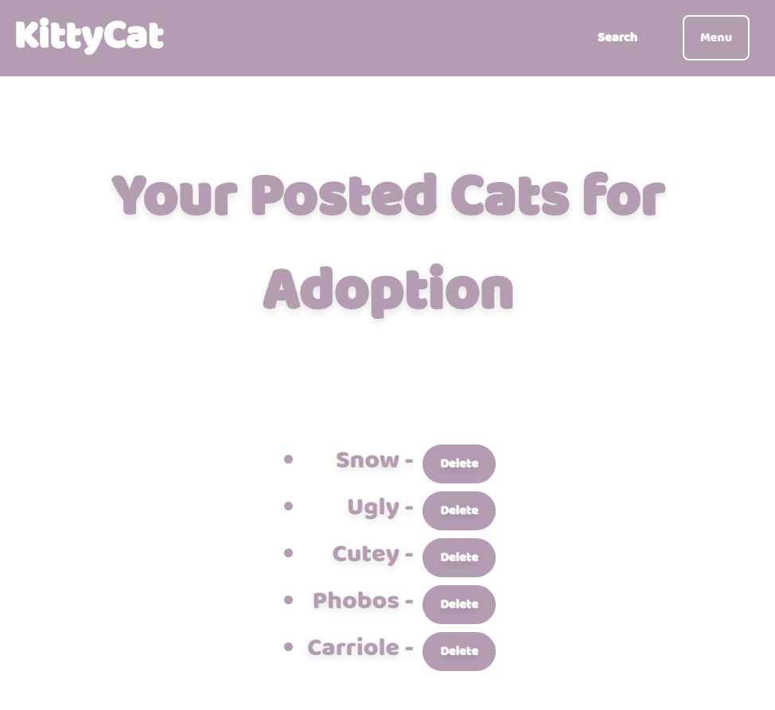

KittyCat Web App:
Welcome to the KittyCat web application! KittyCat is a web app designed to help users find and adopt cats, as well as list cats for adoption. This application is built using Django and PostgreSQL.

Table of Contents:
Introduction
Features
Installation
Usage
Contributing
Related Projects
Licensing

Introduction:
KittyCat is a web application designed to connect people with cats in need of adoption. Users can browse available cats, post their own cats for adoption, and manage adoption requests. Built with Django and PostgreSQL, KittyCat aims to make the adoption process seamless and user-friendly.

Deployed Site: https://maissaranejmi1999.github.io/landing-page/
Final Project Blog Article: Read the Blog Article
Author: https://www.linkedin.com/in/maissara-nejmi/

Features:
User Authentication: Sign up, sign in, and manage user profiles.

Cat Listings: Browse, search, and view details of available cats for adoption.

Add Cats for Adoption: Post cats for adoption with detailed information and images.

Adoption Requests: Send and manage adoption requests for cats.

Profile Management: View and manage posted cats and adoption requests.

Installation:
To set up and run the KittyCat web app locally, follow these steps:

Clone the Repository:
git clone https://github.com/yourusername/KittyCat.git
cd KittyCat

Set Up a Virtual Environment:
python3 -m venv env
source env/bin/activate  # On Windows, use `env\Scripts\activate`

Install Dependencies:
pip install -r requirements.txt

Set Up the Database:
Make sure PostgreSQL is installed and running.
Update kittycat/settings.py with your PostgreSQL database credentials.
Run the migrations to set up the database schema:
python manage.py migrate

Create a Superuser:
python manage.py createsuperuser

Run the Development Server:
python manage.py runserver

Access the App: Open your web browser and go to http://127.0.0.1:8000/ to see the app in action.

Usage:
Homepage: Browse available cats, sign up, or sign in.
Profile Page: Manage your posted cats and view adoption requests.
Add Cat: Post new cats for adoption using the provided form.
My Cat Requests: View and manage adoption requests you've sent.
Received Requests: View and manage requests received for your posted cats.

Contributing:
Contributions to KittyCat are welcome! If you have suggestions or improvements, please follow these steps:
Fork the repository.
Create a new branch for your feature or fix.
Make your changes and commit them.
Push your branch to your forked repository.
Open a pull request on the main repository.

Related Projects: none

Licensing: none
